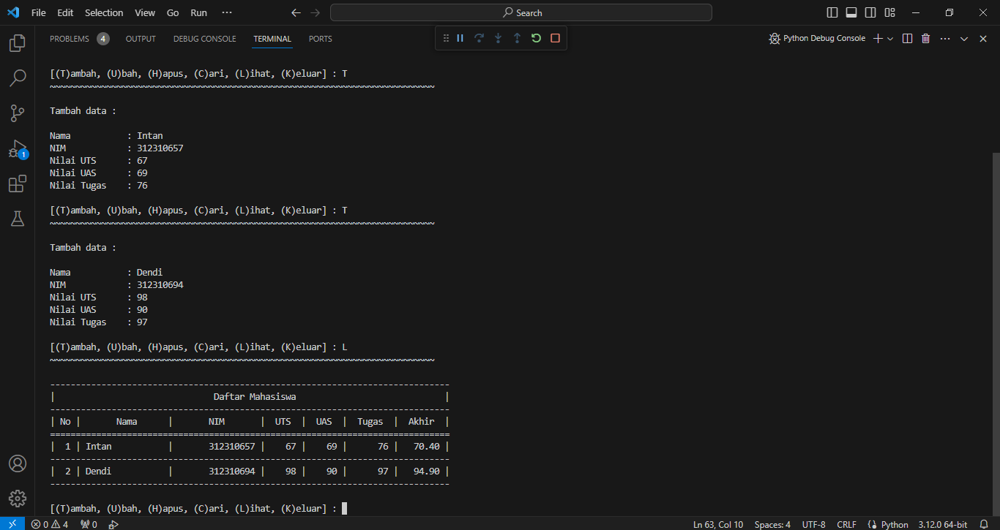

# Pertemuan ke 11

## Profil
| Variable | Isi |
| -------- | --- |
| **Nama** | Intan Virginia Aulia Putri |
| **NIM** | 312310657 |
| **Kelas** | TI.23.A.6 |
| **Mata Kuliah** | Bahasa Pemrograman |

### Latihan 1
Ubahlah kode dibawah ini menjadi fungsi menggunakan lambda.
``` Python
import math

def a(x):
return x**2

def b(x, y):
return math.sqrt(x**2 + y**2)

def c(*args):
return sum(args)/len(args)

def d(s):
return "".join(set(s))
```

### Setelah diubah
``` Python
def a(x):
    return x**2
# Mengubah kedalam lambda function
a = lambda x: x**2


def b(x, y):
    return nath.sqrt(X*2 + y*2)
# Mengubah kedalam lambda function
b = lambda x,y: math.sqrt(x*2 + y*2)


def c(*args):
    return sun(args)/len(args)
# Mengubah kedalam lambda function
c = lambda *args: sum(args)/len(args)


def d(s):
    return "".joinn(set(s))
# Mengubah kedalam lambda function
d = lambda s: "".join(set(s))
```
Penjelasan
1. Fungsi a(x): Fungsi ini mengembalikan kuadrat dari nilai yang diberikan.
2. `a = lambda x: x**2`: Membuat lambda function yang melakukan hal yang sama dengan fungsi `a(x)`.
3. Fungsi b(x, y): Fungsi ini mengembalikan akar kuadrat dari jumlah kuadrat dari `x` dan `y`.
4. `b = lambda x, y: math.sqrt(x*2 + y*2)`: Membuat lambda function yang melakukan hal yang sama dengan fungsi `b(x, y)`.
5. Fungsi c(args): Fungsi ini mengembalikan rata-rata dari sejumlah argumen yang diberikan.
6. `c = lambda *args: sum(args) / len(args)`: Membuat lambda function yang melakukan hal yang sama dengan fungsi `c(*args)`.
7. Fungsi d(s): Fungsi ini mengembalikan string unik dari karakter-karakter yang ada dalam string `s`.
8. `d = lambda s: "".join(set(s))`: Membuat lambda function yang melakukan hal yang sama dengan fungsi `d(s)`.

## Tugas Praktikum
Buat program sederhana dengan mengaplikasikan penggunaan fungsi yang akan menampilkan daftar nilai mahasiswa, dengan ketentuan:
- Fungsi tambah() untuk menambah data
- Fungsi tapilkan() untuk menampilkan data
- Fungsi hapus(nama) untuk menghapus data berdasarkan nama
- Fungsi ubah(nama) untuk mengubah data berdasarkan nama
- Buat flowchart dan penjelasan programnya
``` Python
list = {}

def garis():
    '''Fungsi garis'''
    print("~"*80)

    # Menambahkan data inputan 
def tambah():
    print("Tambah data :\n")
    nama    = input("Nama           : ")
    nim     = int(input("NIM            : "))
    uts     = int(input("Nilai UTS      : "))
    uas     = int(input("Nilai UAS      : "))
    tugas   = int(input("Nilai Tugas    : "))
    akhir = (tugas * 30/100) + (uts * 35/100) + (uas * 35/100)
    list[nama] = [nim, tugas, uts, uas, akhir]

    # Mengubah data inputan
def ubah():
    print("Ubah Data :")
    nama = input("\nMasukkan Nama  : ")
    if nama in list.keys():
        nim     = int(input("NIM            : "))
        uts     = int(input("Nilai UTS      : "))
        uas     = int(input("Nilai UAS      : "))
        tugas   = int(input("Nilai Tugas    : "))
        akhir = (tugas * 30/100) + (uts * 35/100) + (uas * 35/100)
        list[nama] = [nim, tugas, uts, uas, akhir]
    else:
        print("NAMA {0} TIDAK ADA!".format(nama))

    # Menghapus inputan Nama
def hapus():
    print("Hapus berdasarkan nama inputan :")
    nama = input("\nMasukkan Nama  : ")
    if nama in list.keys():
        del list[nama]
        print("\nData {0} berhasil di hapus".format(nama))
    else:
        print("NAMA {0} TIDAK ADA!".format(nama))
    
    # Mencari data yg sudah di input
def cari():
    print("Cari data berdasarkan nama inputan :")
    nama = input("\nMasukkan Nama : ")
    if nama in list.keys():
        print(f"\nNama        : {nama}")
        print(f"NIM         : {list[nama][0]}")
        print(f"Nilai UTS   : {list[nama][2]}")
        print(f"Nilai UAS   : {list[nama][3]}")
        print(f"Nilai Tugas : {list[nama][1]}")                  
        print(f"Nilai Akhir : {list[nama][4]}") 
    else:
        print("NAMA {0} TIDAK ADA!".format(nama))
    
    # Menampilkan seluruh data 
def lihat():
    if list.items():
        print("-"*78)
        print("|                               Daftar Mahasiswa                             |")
        print("-"*78)                 
        print("| No |       Nama      |       NIM       |  UTS  |  UAS  |  Tugas  |  Akhir  |")
        print("="*78)
        i = 0
        for data in list.items():
            i += 1
            print("| {no:2d} | {0:15s} | {1:15d} | {2:5d} | {3:5d} | {4:7d} | {5:7.2f} |"
                .format(data[0][:13], data[1][0], data[1][2], data[1][3], data[1][1], data[1][4], no=i))
            print("-"*78)
    else:
        print("-"*78)
        print("|                               Daftar Mahasiswa                             |")
        print("-"*78)
        print("|No. | Nama            |       NIM       |  UTS  |  UAS  |  Tugas  |  Akhir  |")
        print("-"*78)
        print("|                       TIDAK ADA DATA! Silakan tambah data                  |")
        print("-"*78)


print("="*20)
print("|PROGRAM INPUT DATA|")
print("="*20)

while True: 
    print()
    menu = input("[(T)ambah, (U)bah, (H)apus, (C)ari, (L)ihat, (K)eluar] : ")
    print("~"*75)
    print()

    if menu.lower() == 't':
        tambah()

    elif menu.lower() == 'u':
        ubah()       

    elif menu.lower() == "h":
        hapus() 

    elif menu.lower() == "c":
        cari()

    elif menu.lower() == "l":
        lihat() 

    elif menu.lower() == "k":
        print("Program selesai, Terima Kasih :) ")
        break

    else:
        print("\n INPUT {} TIDAK ADA!, Silakan pilih [T/U/H/C/L] untuk menjalankan program!".format(menu))
```
Penjelasan
1. Fungsi `garis()`:
    - Fungsi ini digunakan untuk mencetak garis pemisah sepanjang 80 karakter.
    - Berguna untuk memperindah tampilan output dan memisahkan setiap aksi.
2. Fungsi `tambah()`:
    - Fungsi ini menangani penambahan data mahasiswa baru ke dalam dictionary `list`.
    - Pengguna diminta memasukkan nama, NIM, nilai UTS, nilai UAS, dan nilai Tugas.
    - Data tersebut kemudian dimasukkan ke dalam dictionary `list` dengan nama sebagai kunci.
3. Fungsi `ubah()`:
    - Fungsi ini digunakan untuk mengubah data mahasiswa yang sudah ada dalam dictionary `list`.
    - Pengguna diminta memasukkan nama mahasiswa yang ingin diubah.
    - Jika nama tersebut ada dalam dictionary, data mahasiswa tersebut dapat diubah.
4. Fungsi `hapus()`:
    - Fungsi ini menangani penghapusan data mahasiswa berdasarkan nama dari dictionary `list`.
    - Pengguna diminta memasukkan nama mahasiswa yang ingin dihapus.
    - Jika nama tersebut ada dalam dictionary, data mahasiswa tersebut dihapus.
5. Fungsi `cari()`:
    - Fungsi ini digunakan untuk mencari data mahasiswa berdasarkan nama dalam dictionary `list`.
    - Pengguna diminta memasukkan nama mahasiswa yang ingin dicari.
    - Jika nama tersebut ada dalam dictionary, data mahasiswa tersebut ditampilkan.
6. Fungsi `lihat()`:
    - Fungsi ini menampilkan seluruh data mahasiswa dalam bentuk tabel.
    - Jika dictionary `list` tidak kosong, data mahasiswa ditampilkan dalam format tabel.
    - Jika dictionary kosong, pesan bahwa tidak ada data ditampilkan.
7. Menu Utama:
    - Program memiliki loop utama yang terus berjalan sampai pengguna memilih untuk keluar.
    - Setiap iterasi loop, pengguna diminta untuk memilih aksi seperti tambah, ubah, hapus, cari, lihat, atau keluar.
    - Aksi yang dipilih dijalankan sesuai dengan fungsi yang telah didefinisikan.

#### Tampilan output


#### Tampilan Flowchart


